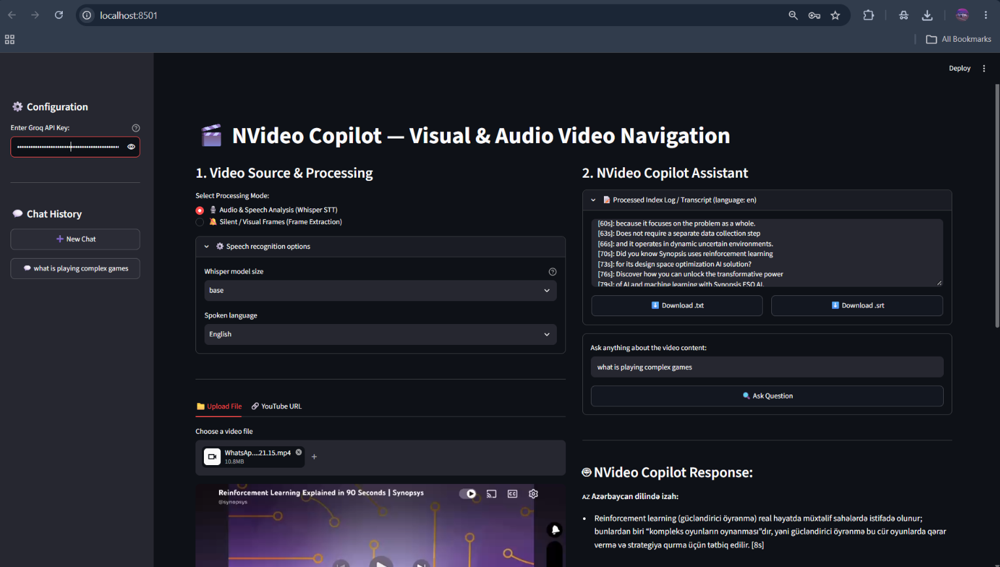
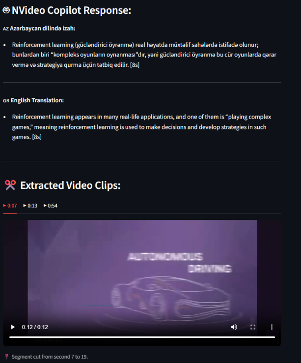

# 🎬 NVideo Copilot

Ask questions about any video and jump straight to the moment that answers them.

NVideo Copilot transcribes a video (or describes its frames when it has no speech), indexes the result, and lets you chat with it. Every answer is written in **Azerbaijani and English**, cites the timestamps it relies on, and comes with the matching **video clips** cut automatically.




   

## Features

- **Two analysis modes**
  - 🎙️ **Audio & Speech**: local speech-to-text with [faster-whisper](https://github.com/SYSTRAN/faster-whisper) (selectable model size and language).
  - 🔕 **Silent / Visual Frames**: frames are sampled and described by a Groq vision model, so videos without speech are searchable too.
- **Sources**: upload a file (mp4, mov, mkv, webm, avi) or paste a YouTube link.
- **Grounded answers**: the model answers only from the transcript and ends each claim with a `[12s]` timestamp.
- **Automatic clips**: up to 3 clips (12 s each) are cut around the timestamps the answer cites.
- **Works on long videos**: short transcripts are sent whole; long ones are narrowed down to the relevant parts with a ChromaDB vector search.
- **Export**: download the transcript as `.txt` or `.srt` subtitles.
- **Chat history** in the sidebar, progress bars, and readable error messages.

## Quick start

Requirements: Python 3.10+ and a free [Groq API key](https://console.groq.com/keys).

```bash
git clone https://github.com/<nihatrasulzada>/nvideo-copilot.git
cd NVideo-Copilot

python -m venv .venv
# Windows: .venv\Scripts\activate      macOS/Linux: source .venv/bin/activate

pip install -r requirements.txt
streamlit run main.py
```

Enter your Groq API key in the sidebar, or save it once in a `.env` file:

```bash
cp .env.example .env      # then edit .env and set GROQ_API_KEY=...
```

> The first run downloads the Whisper model and ChromaDB's embedding model, so it needs an internet connection and a little patience.

## Project structure

```
├── main.py                 # Entry point
├── config.py               # All settings in one place
├── ui/                     # Streamlit interface
│   ├── header.py
│   ├── sidebar.py          # API key and chat history
│   ├── video_panel.py      # Upload / YouTube / processing
│   └── assistant_panel.py  # Questions, answers, clips, exports
├── core/                   # Logic (no UI code)
│   ├── media.py            # FFmpeg, yt-dlp, clip cutting
│   ├── transcription.py    # Whisper and frame description
│   ├── vector_store.py     # ChromaDB
│   ├── llm.py              # Groq (text + vision)
│   ├── formatting.py       # Transcript, SRT, citations, context building
│   ├── models.py
│   └── state.py            # Streamlit session state
└── tests/                  # pytest suite
```

## Configuration

Most options live in [`config.py`](config.py). A few can be set through `.env`:

| Variable | Purpose |
|---|---|
| `GROQ_API_KEY` | Your Groq key (so you don't type it each time) |
| `NVIDEO_VISION_MODEL` | Vision model for Visual mode (default `qwen/qwen3.8-27b`) |
| `NVIDEO_MAX_VISION_FRAMES` | Max frames described in Visual mode (default 12) |
| `NVIDEO_MULTILINGUAL` | `1` enables multilingual vector search (needs `pip install sentence-transformers`) |

**Tips**

- For Azerbaijani speech, pick the **small** Whisper model and set the language explicitly.
- Each analyzed frame costs about 2,000 tokens on Groq. Raise `NVIDEO_MAX_VISION_FRAMES` only if your rate limits allow it.

## Tests

```bash
pip install -r requirements-dev.txt
pytest
```

The suite uses real FFmpeg and ChromaDB, and mocks only the Groq calls.

## Notes

- Built as a **single-user local app**: the vector index is shared by all browser sessions of the same server.
- Only analyze videos you have the right to use.

## License

[MIT](LICENSE)

---

## 🇦🇿 Azərbaycanca qısa izah

NVideo Copilot videonu mətnə çevirir (və ya səssiz videoda kadrları təsvir edir), sonra video haqqında sual verə bilərsən. Cavab həm Azərbaycan, həm də ingilis dilində gəlir, istifadə olunan vaxtları göstərir və uyğun video klipləri avtomatik kəsir.

Qurulum: `pip install -r requirements.txt`, sonra `streamlit run main.py`. Groq API açarını sol paneldə yaz və ya `.env` faylına `GROQ_API_KEY=...` kimi əlavə et. Azərbaycan dilində nitq üçün Whisper-in **small** modelini seçmək məsləhətdir.
